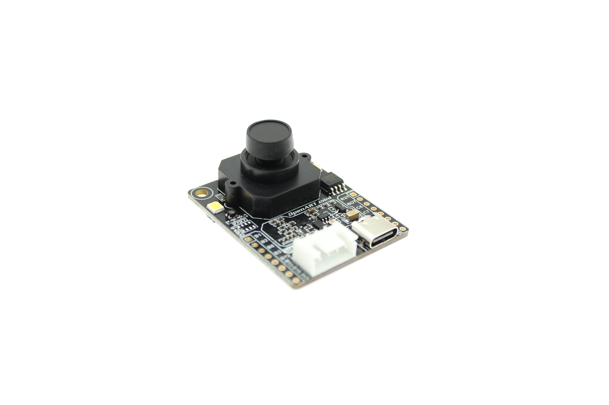

# 逐飞科技OpenART mini视觉模块资料

#### 介绍
逐飞科技联合恩智浦基于RT1060系列主控制作的视觉识别模块，支持目标检测、分类识别等应用。

#### 学习套件
OpenART mini视觉模块:[点击此处购买](https://item.taobao.com/item.htm?id=637029649233)。

##### OpenART mini视觉模块

#### 模块特点

1. **MIMXRT106F主控芯片，主频600MHZ，1M片内SRAM、8M片外FLASH以及32M外置SDRAM**
2. **RT-THREAD内核、驱动、软件组件及开发环境**
3. **支持TENSORFLOW LITE神经网络**
